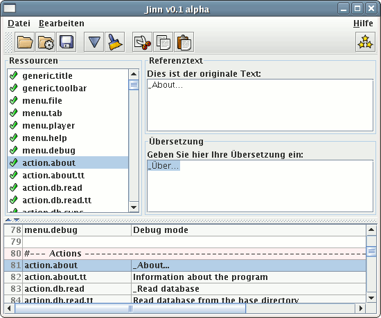

# Jinn

_Jinn_ is a Java tool for translating properties files into other languages.



## Features

* Simple to use. Even people without programming skills can translate a software.
* Keeping an eye on the original: a properties view always shows the context in the reference document.
* Even exotic properties files are supported, as long as they comply to the Java standard.
* Automatically Unicode encoding of all characters not displayable in ISO-8859-1.
* Encoding of special and control characters. The translator just types plain, multi line text.
* Jinn is itself completely written in Java, and runs on Windows, Linux and MacOS X.

## Usage

Just run the jar file:

```
java -jar target/jinn.jar
```

## Contribute

* Fork the [Source code at GitHub](https://github.com/shred/jinn). Feel free to send pull requests.
* Found a bug? [File a bug report!](https://github.com/shred/jinn/issues)

## License

_Jinn_ is distributed under [GPLv3](http://www.gnu.org/licenses/gpl-3.0.html).
